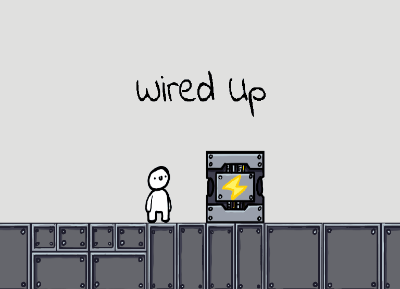

## Wired Up

 

* * *

Wired up was developed for the 2021 GMTK game jam. The project was a collaboration between myself and friends as an excersie to improve our workflow as a team before tackling Dare academy. I handled level design for the early stages of the project aswell as audio design and implementation.

[back](./)
